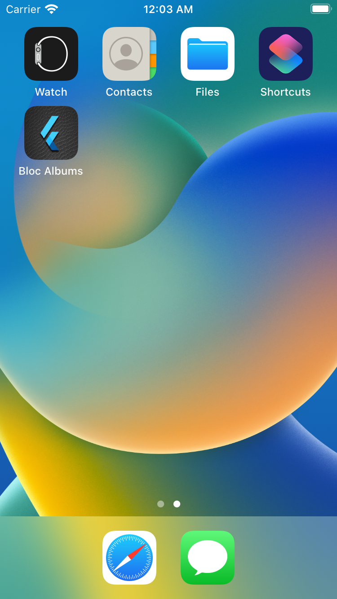
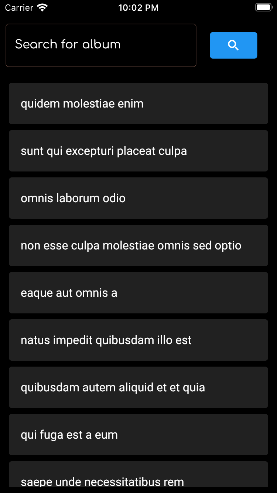
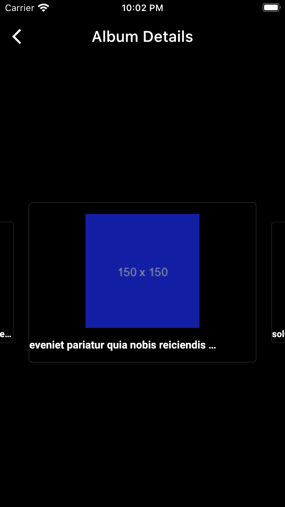
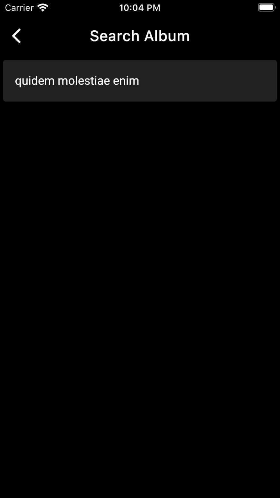
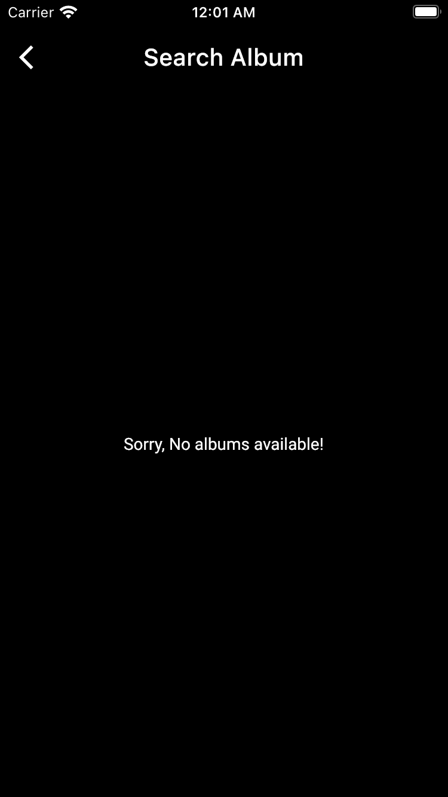

# Bloc Album

Flutter project developed following Clean Architecture, Bloc for State management & Retrofit for API call

- Application can be build in Android, IOS and Web

### Steps to Run the application
- Make sure flutter is installed in your system
- Navigate to project home directory

#### In Android / IOS simulator or connected device
> flutter run

#### Chrome
> flutter run -d chrome --web-renderer html

### Running test
Included unit tests and widget test, using 'bloc_test' and 'mocktail' 
> flutter test test/flutter_test.dart

###
### SCREEN SHOTS
####

 

####

####

####

####

####

